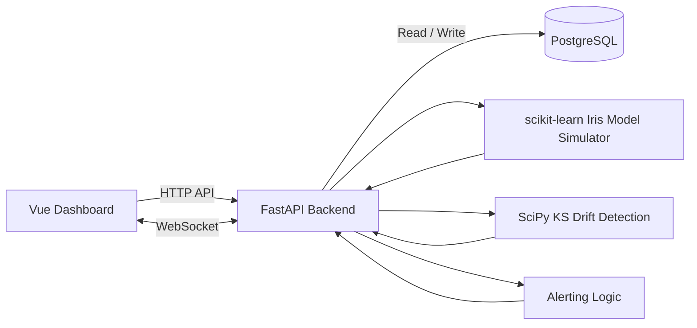

# AI Observability & MLOps Dashboard

A minimal but credible full-stack monitoring dashboard for deployed machine learning models.

This project demonstrates how production ML systems can be monitored for inference latency, confidence degradation, and statistical data drift using a Dockerized FastAPI, PostgreSQL, and Vue.js stack.

## Project Summary

This dashboard simulates a deployed machine learning model and monitors its behavior over time.

It supports:

- Inference log collection
- PostgreSQL-backed event storage
- Latency and confidence monitoring
- Real-time dashboard updates using WebSockets
- Statistical drift detection using the Kolmogorov–Smirnov test
- Alerting for high latency, low confidence, and detected data drift
- Batch simulation of normal and drifted production traffic

## CV Description

Designed and implemented a monitoring platform for deployed machine learning models, focusing on data drift detection and inference latency monitoring. Implemented statistical drift detection using the Kolmogorov–Smirnov test to identify distribution shifts between training and production datasets. Developed backend services with FastAPI to collect, process, and analyze model inference logs stored in PostgreSQL. Built a real-time dashboard in Vue.js using WebSockets and Chart.js to visualize latency, confidence scores, and drift metrics. Simulated production data drift scenarios to evaluate monitoring effectiveness and validate alerting mechanisms.

## Tech Stack

| Layer | Technology |
|---|---|
| Backend API | FastAPI |
| ML Model | scikit-learn |
| Statistics | SciPy |
| Database | PostgreSQL |
| Frontend | Vue.js |
| Charts | Chart.js |
| Real-time Updates | WebSockets |
| Containerization | Docker, Docker Compose |
| Tests | pytest |

## Architecture



## Main Features

### Inference Logging

The backend stores model inference events in PostgreSQL.

Each inference log includes:

- Request ID
- Model name
- Input features
- Prediction
- Confidence score
- Latency in milliseconds
- Profile: `manual`, `normal`, or `drift`
- Timestamp

### Model Simulation

The project uses the Iris dataset and a scikit-learn logistic regression model.

It supports two simulation modes:

- `normal`: production data similar to the training distribution
- `drift`: shifted production data to simulate feature drift

### Metrics Dashboard

The Vue dashboard displays:

- Total inference logs
- Average latency
- p95 latency
- Maximum latency
- Average confidence
- Low-confidence event count
- Prediction distribution
- Latency over time
- Confidence over time
- Recent inference logs

### Data Drift Detection

The backend stores Iris training feature values as reference data.

The drift endpoint compares reference feature distributions against recent production logs using the two-sample Kolmogorov–Smirnov test.

For each feature, the API returns:

- Reference sample count
- Production sample count
- Reference mean
- Production mean
- KS statistic
- p-value
- Drift status

### Alerting

The backend evaluates alert rules for:

- High p95 latency
- Low average confidence
- Low-confidence inference events
- KS data drift detection

The frontend displays active alerts with severity levels:

- `critical`
- `warning`
- `info`

## Project Structure

```text
.
├── backend
│   ├── app
│   │   ├── alerts.py
│   │   ├── db.py
│   │   ├── drift.py
│   │   ├── main.py
│   │   ├── model.py
│   │   ├── reference_data.py
│   │   ├── schemas.py
│   │   └── websocket_manager.py
│   ├── tests
│   │   └── test_api.py
│   ├── Dockerfile
│   ├── pytest.ini
│   └── requirements.txt
├── frontend
│   ├── src
│   │   ├── App.vue
│   │   ├── main.js
│   │   └── style.css
│   ├── Dockerfile
│   ├── index.html
│   ├── package.json
│   └── vite.config.js
├── docker-compose.yml
├── .env.example
├── .gitignore
└── README.md
```

## Getting Started

### 1. Clone the repository

```bash
git clone <your-repo-url>
cd ai-observability-dashboard
```

### 2. Create environment file

```bash
cp .env.example .env
```

### 3. Start the application

```bash
docker compose up --build
```

### 4. Open the dashboard

Frontend:

```text
http://localhost:5173
```

Backend API docs:

```text
http://localhost:8000/docs
```

Health check:

```text
http://localhost:8000/health
```

## Useful Commands

Start the stack:

```bash
docker compose up --build
```

Stop the stack:

```bash
docker compose down
```

Stop and delete database volume:

```bash
docker compose down -v
```

Only use `docker compose down -v` if you want to reset all PostgreSQL data.

## API Examples

### Health check

```bash
curl http://localhost:8000/health
```

### Database health check

```bash
curl http://localhost:8000/health/db
```

### Create a manual inference log

```bash
curl -X POST http://localhost:8000/inference-logs \
  -H "Content-Type: application/json" \
  -d '{
    "request_id": "manual-001",
    "model_name": "iris-classifier",
    "features": {
      "sepal_length": 5.1,
      "sepal_width": 3.5,
      "petal_length": 1.4,
      "petal_width": 0.2
    },
    "prediction": 0,
    "confidence": 0.97,
    "latency_ms": 18.4
  }'
```

### Simulate one normal inference

```bash
curl -X POST "http://localhost:8000/simulate-inference?profile=normal" | python3 -m json.tool
```

### Simulate one drifted inference

```bash
curl -X POST "http://localhost:8000/simulate-inference?profile=drift" | python3 -m json.tool
```

### Generate normal traffic

```bash
curl -X POST "http://localhost:8000/simulate-batch?profile=normal&count=25" | python3 -m json.tool
```

### Generate drifted traffic

```bash
curl -X POST "http://localhost:8000/simulate-batch?profile=drift&count=25" | python3 -m json.tool
```

### View metrics summary

```bash
curl http://localhost:8000/metrics/summary | python3 -m json.tool
```

### View KS drift report

```bash
curl "http://localhost:8000/drift/ks?profile=all&limit=100&min_samples=20" | python3 -m json.tool
```

### View current alerts

```bash
curl "http://localhost:8000/alerts/current?limit=100" | python3 -m json.tool
```

## Run Backend Tests

Start the stack:

```bash
docker compose up --build
```

In another terminal, run:

```bash
docker compose exec backend pytest -q
```

Expected result:

```text
8 passed
```

## Demo Workflow

Use this workflow to demonstrate the project.

### 1. Start the application

```bash
docker compose up --build
```

### 2. Open the dashboard

```text
http://localhost:5173
```

### 3. Generate normal traffic

```bash
curl -X POST "http://localhost:8000/simulate-batch?profile=normal&count=50"
```

The dashboard should show stable metrics.

### 4. Generate drifted traffic

```bash
curl -X POST "http://localhost:8000/simulate-batch?profile=drift&count=50"
```

The dashboard should update in real time and show drift detection results.

### 5. Review alerts

```bash
curl "http://localhost:8000/alerts/current?limit=100" | python3 -m json.tool
```

The alert panel should show active alerts if drift or degraded metrics are detected.

## Screenshots

Add screenshots here before publishing the repository.

Suggested screenshots:

```text
docs/screenshots/dashboard-overview.png
docs/screenshots/drift-detection.png
docs/screenshots/alerts-panel.png
```

Recommended sections:

### Dashboard Overview

Shows latency, confidence, prediction distribution, and recent logs.

### Drift Detection

Shows KS statistics and p-values for each feature.

### Alerts Panel

Shows critical, warning, and info alerts triggered by monitoring rules.

## Key Endpoints

| Method | Endpoint | Description |
|---|---|---|
| GET | `/health` | Backend health check |
| GET | `/health/db` | PostgreSQL health check |
| GET | `/model/info` | Model metadata |
| POST | `/inference-logs` | Create manual inference log |
| GET | `/inference-logs` | List recent inference logs |
| POST | `/simulate-inference` | Generate one simulated inference |
| POST | `/simulate-batch` | Generate batch simulated traffic |
| GET | `/metrics/summary` | Summary metrics |
| GET | `/metrics/predictions` | Prediction distribution |
| GET | `/metrics/timeseries` | Latency and confidence time series |
| GET | `/reference-data/summary` | Reference training data summary |
| GET | `/drift/ks` | KS drift detection report |
| GET | `/alerts/current` | Current monitoring alerts |
| WS | `/ws/dashboard` | Real-time dashboard updates |

## Current Status

The project currently includes:

- FastAPI backend
- PostgreSQL service
- Health endpoint
- Inference log storage API
- Persistent inference profile tracking: manual, normal, and drift
- Stored Iris training reference data in PostgreSQL
- Reference feature summary endpoint
- Kolmogorov–Smirnov drift detection using SciPy
- Drift detection API comparing training reference data against production inference logs
- Backend alerting logic for latency, confidence, and drift
- Current alerts API endpoint
- Frontend alert panel with critical, warning, and info alert visibility
- Drift detection dashboard panel with KS statistic and p-value table
- Batch simulation endpoint for generating normal or drifted traffic
- scikit-learn Iris model simulator
- Normal and drifted inference simulation
- Backend metrics endpoints for latency, confidence, and prediction counts
- WebSocket endpoint for real-time dashboard updates
- Vue dashboard with Chart.js visualizations
- UI controls for simulating normal and drifted inference
- Lightweight backend test suite with pytest
- Docker Compose workflow

## Limitations

This is a portfolio-focused MLOps observability project, not a production-grade monitoring platform.

Intentionally excluded to keep the project minimal:

- Kubernetes
- Kafka
- Spark
- MLflow
- Redis
- Celery
- Cloud services
- Authentication
- Multi-model registry
- Distributed tracing

## Future Improvements

Possible extensions:

- Add user authentication
- Add model version tracking
- Add configurable alert thresholds from the frontend
- Add CSV export for inference logs
- Add more statistical drift tests
- Add frontend tests
- Add GitHub Actions CI

## Copyright

Copyright © 2026 Ahmad Alzeitoun All rights reserved.

This project is provided for portfolio purposes. Unauthorized copying, redistribution, or commercial use of this project without permission is not allowed.
